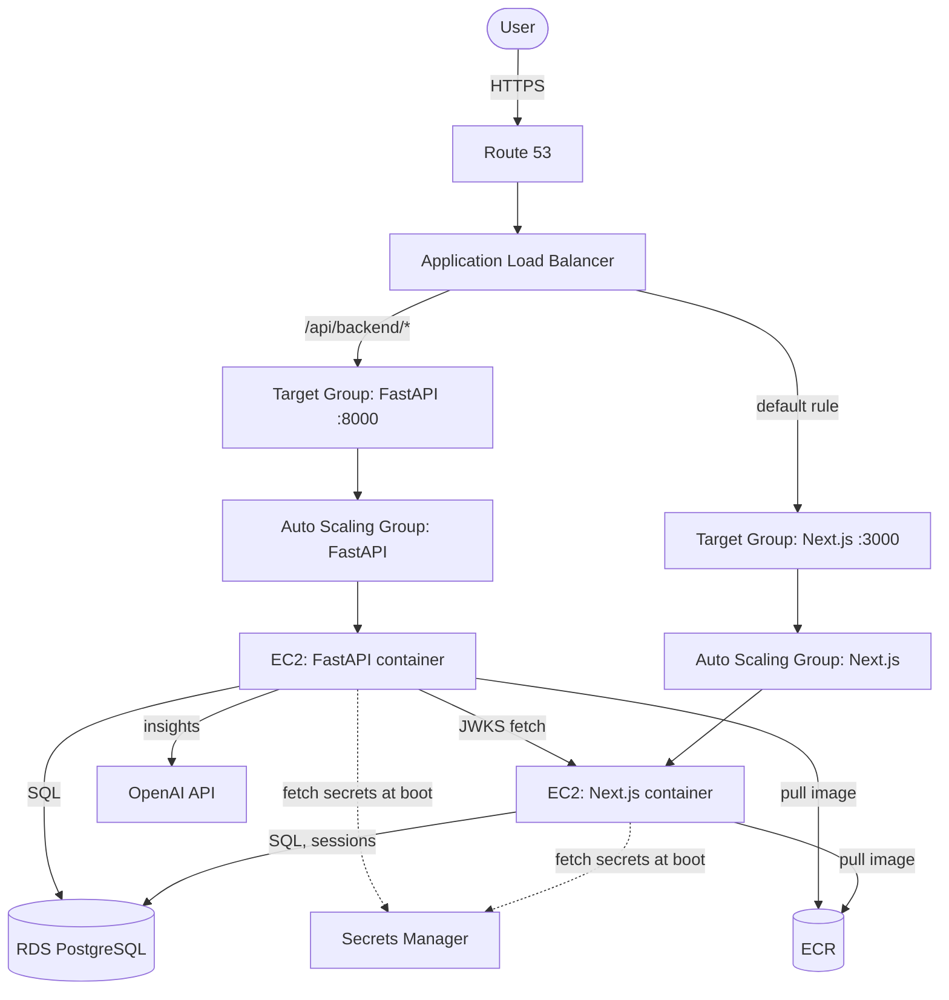

# Finance Dashboard

A full-stack personal finance dashboard for tracking accounts, categories, and transactions, with interactive charts, date-range filtering, and AI-generated spending insights. Deployed on a production AWS environment with auto-scaling, HTTPS, and Google OAuth.

**Live:** [https://shak-financedashboard.com](https://shak-financedashboard.com)

## Features

- 📊 **Overview dashboard** — income/expenses/remaining balance cards, area/line/bar charts, category breakdown pie chart, all filterable by custom date range (persisted via URL query params).
- 🤖 **AI Spending Insights** — an LLM analyzes your transaction data for the selected period and surfaces flagged spending patterns (severity-tagged) plus a personalized suggestion, streamed in independently of the rest of the page via React Suspense.
- 💳 **Accounts, Categories & Transactions** — full CRUD with searchable comboboxes, inline creation, and CSV import for bulk transaction upload.
- 🔐 **Authentication** — email/password and Google OAuth sign-in via [better-auth](https://www.better-auth.com/), with JWT-based auth between the frontend and backend.
- 📱 **Responsive UI** — mobile nav drawer, adaptive layouts, shadcn/ui (Base UI primitives) + Tailwind v4.

## Tech Stack

**Frontend**
- Next.js 16 (App Router), React 19, TypeScript
- Tailwind CSS v4, shadcn/ui (Base UI primitives)
- Valtio for client-side state
- Recharts for data visualization
- Biome for linting/formatting

**Backend**
- FastAPI (Python), SQLAlchemy (async) + asyncpg
- JWT verification via JWKS (issued by better-auth)
- OpenAI Responses API for spending insights
- Repository → *(separate repo — FinanceDashboardBackend)*

**Database**
- PostgreSQL (Amazon RDS)

**Infrastructure (AWS)**
- Custom VPC with public/private subnets across 3 AZs, NAT Gateway
- Application Load Balancer with path-based routing (`/api/backend/*` → FastAPI, everything else → Next.js), single domain to avoid CORS
- Auto Scaling Groups (EC2) for both frontend and backend, target-tracking scaling on CPU utilization
- RDS PostgreSQL in private subnets
- Secrets Manager for all credentials (DB, auth, OpenAI, Google OAuth), fetched at instance boot via IAM instance role
- ECR for Docker image storage
- Route 53 + ACM for domain and TLS
- EC2 Instance Connect Endpoint for bastion-less SSH access to private instances

## Architecture



Auth is handled entirely by the Next.js app (better-auth, email/password + Google OAuth). It issues JWTs that the FastAPI backend verifies against better-auth's JWKS endpoint — the two services never share a session store directly.

## Local Development

### Prerequisites
- Node.js 20+
- A local PostgreSQL instance
- The FastAPI backend running separately (for non-auth data)

### Setup

```bash
npm install
cp .env.example .env   # fill in the values below
npm run dev
```

Open [http://localhost:3000](http://localhost:3000).

### Environment Variables

| Variable | Description |
|---|---|
| `BETTER_AUTH_SECRET` | Secret used by better-auth to sign sessions/JWTs |
| `BETTER_AUTH_URL` | Base URL of this app (e.g. `http://localhost:3000`) |
| `DB_USER` / `DB_PASSWORD` / `DB_HOST` / `DB_PORT` / `DB_DATABASENAME` | PostgreSQL connection details |
| `NEXT_PUBLIC_BACKEND_URL` | Base URL of the FastAPI backend, e.g. `http://localhost:8000/api/backend` |
| `GOOGLE_CLIENT_ID` / `GOOGLE_CLIENT_SECRET` | Google OAuth credentials (from Google Cloud Console) |

## Deployment

The frontend is containerized (`Dockerfile`, multi-stage build with Next.js `standalone` output) and built with `--platform linux/amd64` for x86 EC2 compatibility. `NEXT_PUBLIC_BACKEND_URL` is baked in at build time via `--build-arg`; all other config is injected at container runtime from AWS Secrets Manager via the EC2 instance's user-data script.

```bash
docker build \
  --platform linux/amd64 \
  --build-arg NEXT_PUBLIC_BACKEND_URL=https://shak-financedashboard.com/api/backend \
  -t finance-dashboard-frontend .
```

Instances are managed by an Auto Scaling Group behind an ALB; new images are rolled out via ASG instance refresh rather than in-place updates.
